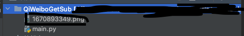

# QiWeiboGetSub
This is a script to get Weibo's cookies.
# Usage
1. Run the code, and you will see a png image with a name containing a timestamp.

2. Open Weibo and scan the QR code (this process cannot last too long, otherwise the QR code will expire).\n
3. After you scan the QR code, you will see the Cookie entered on the console (SUB=xxx).\n
4. You can do many things with your SUB, such as superwordname sign in, etc. \n
5. ⚠️<i>Please do not disclose your sub to strangers. This will endanger your account security.</i>\n
